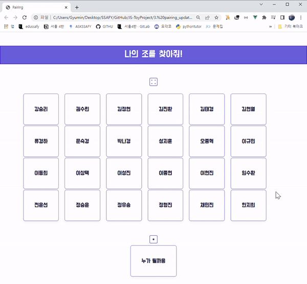

# JS-ToyProject 

work in progress ... :runner:

#### 1. Toast project

* Created a toast with a moving progress bar

#### 2. Glassmorphism Login Form

* Created a fancy login form with glass-like texture

#### 3. Pairing app update

* Added CSS animation to original pairing app - by using canvas-confetti library
  * https://github.com/catdad/canvas-confetti

* Added delete feature on click

